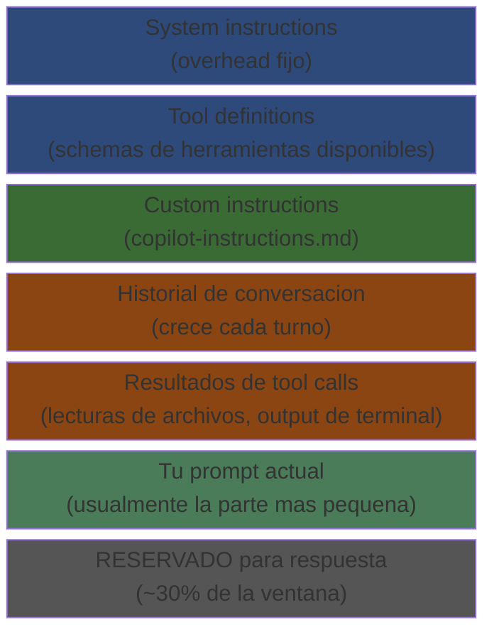
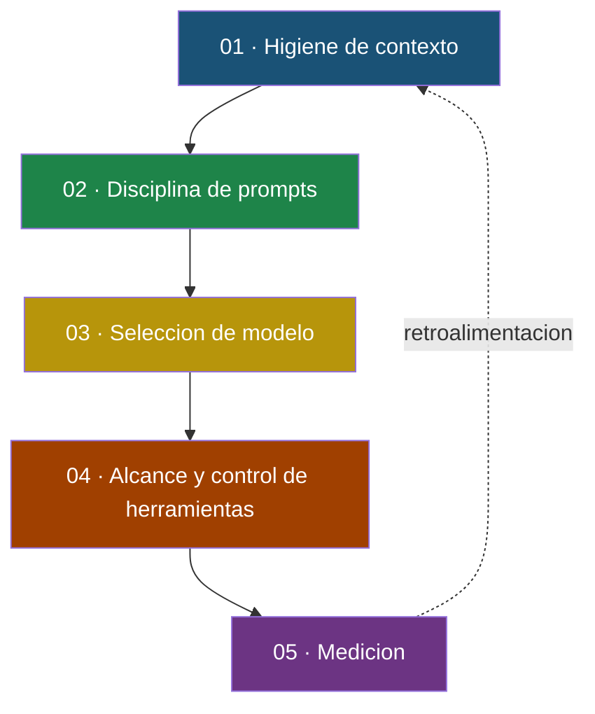
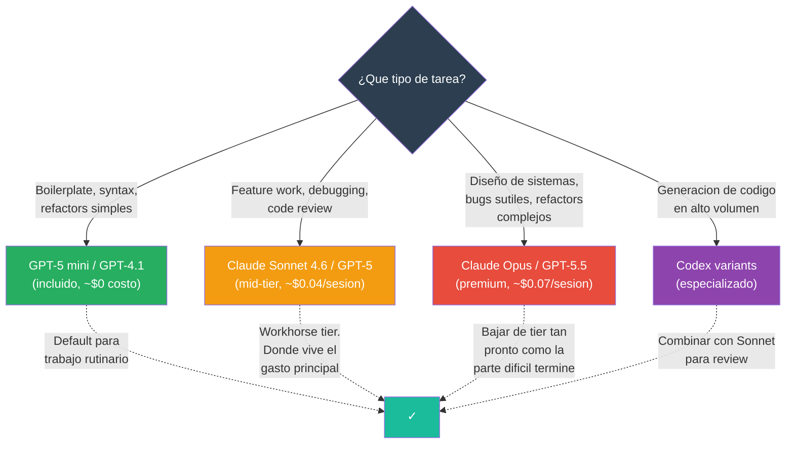
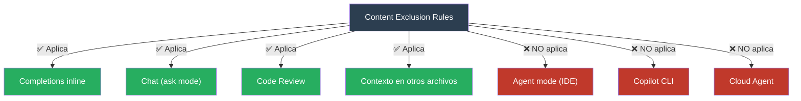

# Optimizacion de Tokens en GitHub Copilot

Guia practica para reducir el consumo de tokens, controlar costos y mejorar la relevancia de las respuestas de GitHub Copilot en entornos enterprise.

> **Actualizado:** Junio 2026. Incluye el modelo de facturacion por GitHub AI Credits vigente desde el 1 de junio de 2026.

---

## Por que importa esto ahora

Desde el 1 de junio de 2026, GitHub Copilot dejo de facturar por Premium Request Units (PRUs) y migro a un modelo basado en tokens llamado **GitHub AI Credits** (1 credito = $0.01 USD). Cada interaccion con Chat, Agent mode, Code Review o Cloud Agent ahora se mide por tokens de entrada, tokens de salida y tokens cacheados, multiplicados por la tarifa del modelo seleccionado.

Los precios base de los planes no cambiaron: Pro sigue en $10/mes, Pro+ en $39/mes, Business en $19/usuario/mes y Enterprise en $39/usuario/mes. Cada plan incluye una asignacion mensual de AI Credits equivalente a su precio. Lo que cambio es que cuando esos creditos se agotan, se paga el excedente o el servicio se detiene.

**Lo que sigue siendo gratuito:** Las completions inline (ghost text) y Next Edit Suggestions (NES) no consumen creditos en ningun plan de pago. Si tu flujo de trabajo se centra en autocompletado mientras escribes codigo, tu factura no cambia.

**Lo que ahora tiene costo medido:** Copilot Chat (ask mode y agent mode), Copilot CLI, Cloud Agent y Code Review. Code Review ademas consume minutos de GitHub Actions desde junio de 2026.

**Dos modelos estan incluidos sin costo adicional** en planes de pago: GPT-4.1 y GPT-5 mini. Los demas 20+ modelos disponibles en el catalogo de Copilot consumen creditos a sus tarifas publicadas. La diferencia de costo entre modelos es dramatica: una sesion tipica de Chat (10K tokens entrada, 1K salida) cuesta ~$0.005 con GPT-5 mini y ~$0.045 con Claude Sonnet 4.6, es decir, 9 veces mas.

> **Fuentes:** [GitHub Blog: Copilot is moving to usage-based billing](https://github.blog/news-insights/company-news/github-copilot-is-moving-to-usage-based-billing/) | [GitHub Docs: Models and pricing](https://docs.github.com/en/copilot/reference/copilot-billing/models-and-pricing) | [GitHub Docs: Requests in Copilot (legacy)](https://docs.github.com/en/copilot/concepts/billing/copilot-requests)

---

## Como Copilot construye el contexto (y por que eso determina tu factura)

Cada request que Copilot envia al modelo incluye un paquete de contexto compuesto por multiples fuentes. Entender que entra en ese paquete es el prerequisito para optimizar cualquier cosa.

### Anatomia de la ventana de contexto



Todo lo anterior a la respuesta son **tokens de entrada** que se re-envian en cada turno. La respuesta del modelo son **tokens de salida**. Ambos son facturables.

### El efecto de re-envio

Este es el concepto mas importante para entender por que las sesiones largas son caras. Cada turno de Copilot re-envia la conversacion completa al modelo. No se envia solo tu ultimo prompt; se envia todo: system instructions, tool definitions, historial de conversacion, resultados de tool calls anteriores, y tu prompt actual.


Una sesion de 50K tokens que dura 40 turnos envia aproximadamente **2 millones de tokens de entrada** acumulados, aunque tu ultimo prompt haya sido de 20 palabras. Bajo billing por tokens, eso se traduce directamente en creditos consumidos.

**Context bloat (inflacion de contexto) es la fuente numero uno de tokens desperdiciados.**

### Completions inline

Las sugerencias de ghost text usan una ventana de contexto reducida (tipicamente 8-16K tokens). El contexto se construye localmente en tu IDE con tres componentes: el **prefix** (codigo antes del cursor), el **suffix** (codigo despues del cursor) usando la tecnica Fill-in-the-Middle (FIM), y fragmentos relevantes de **tabs abiertos** seleccionados por similitud textual mediante fuzzy matching. No se indexa el repositorio completo; el alcance es estrictamente local al editor.

Como las completions inline son gratuitas, la optimizacion aqui no es de costo sino de **relevancia**: menos ruido en el contexto = mejores sugerencias.

### Copilot Chat y Agent mode

Aqui la ventana es mucho mayor: 128K tokens con GPT-4o, 192K con modelos recientes, o hasta 1M si seleccionas Claude como modelo backend. El contexto incluye el archivo activo, codigo seleccionado, archivos referenciados con @workspace, contenido del repositorio indexado, custom instructions (copilot-instructions.md), y el historial completo de la conversacion.

Copilot reserva aproximadamente el 30% de la ventana de contexto (~60K tokens en una ventana de 192K) para la respuesta de salida. Esto es un mecanismo de seguridad para garantizar que el modelo tenga espacio para generar respuestas largas sin cortarse. No es configurable.

### Agent mode y Copilot CLI: los mayores consumidores

Agent mode es donde se concentra el consumo pesado. A diferencia de Chat basico, el agente lee archivos completos (no fragmentos), ejecuta busquedas con resultados verbosos, acumula output de terminal (build logs, test output), y mantiene todo el historial de la sesion en contexto. Una sola tarea agentica puede consumir el equivalente a 10-20 premium requests del modelo anterior.

**Donde se queman tokens tipicamente en sesiones agenticas:**

| Fuente de desperdicio | Descripcion | Impacto |
|----------------------|-------------|---------|
| Leer archivos completos | Pedir que Copilot "mire src/" cuando solo importa una funcion. Un archivo grande puede consumir 20K+ tokens | Alto |
| Sesiones largas sin limpiar | No limpiar contexto entre tareas no relacionadas. El historial crece hasta que se dispara compaction | Alto |
| Custom instructions sobredimensionadas | copilot-instructions.md extenso inyectado en cada turno. Es un impuesto recurrente | Medio-Alto |
| Output verboso de herramientas | Pipear archivos de log completos, output de build, o resultados de tests al contexto en lugar de filtrar | Alto |
| Modelo incorrecto para la tarea | Usar un modelo de razonamiento pesado (Opus) para ediciones rutinarias | Alto |
| Re-descubrimiento | Copilot releyendo el mismo archivo multiples veces porque el contexto se perdio en compaction o /clear a mitad de tarea | Medio |

Cuando la ventana se llena al ~80-95% de capacidad, Copilot ejecuta **compaction automatica**: resume el historial previo, crea checkpoints de recuperacion, y preserva las secuencias de tool calls. Esto puede degradar la calidad de las respuestas porque el modelo pierde detalles del contexto anterior. La compaction misma consume tokens adicionales.

> **Fuentes:** [GitHub Docs: Managing context in Copilot CLI](https://docs.github.com/en/copilot/concepts/agents/copilot-cli/context-management) | [VS Code Docs: Inline suggestions](https://code.visualstudio.com/docs/editing/ai-powered-suggestions) | [GitHub community discussion #188691](https://github.com/orgs/community/discussions/188691) | Anthropic, ["Effective context engineering for AI agents"](https://www.anthropic.com/engineering/effective-context-engineering-for-ai-agents)

---

## Cinco palancas para la eficiencia de tokens

Ordenadas por impacto. La higiene de contexto entrega las ganancias mas grandes; la medicion cierra el ciclo de retroalimentacion.



---

## Palanca 1: Higiene de contexto

No esperar a que Copilot ejecute compaction automatica. Gestionar el contexto proactivamente.

### Comandos de Copilot CLI que pagan por si mismos

| Comando | Que hace | Cuando usarlo |
|---------|----------|---------------|
| `/clear` | Resetea la conversacion completamente | Entre tareas no relacionadas |
| `/compact` | Resume la sesion y libera la mayor parte de la ventana | A mitad de tarea, antes de cambiar de foco |
| `/context` | Muestra un desglose del uso actual de tokens por categoria | Antes de /compact para decidir si vale la pena |
| `/usage` | Totales de tokens por modelo, duracion, archivos tocados | Al final de cada tarea para saber cuanto costo |
| `/resume` | Reabre una sesion anterior con su resumen guardado | Cuando retomas una tarea previa sin empezar de cero |
| `/new` | Inicia una sesion fresca (alternativa a /clear) | Al comenzar una tarea nueva |

### Habitos que funcionan

Pensar en sesiones como branches: una sesion nueva por cada tarea. Ejecutar `/context` antes de `/compact` porque si estas por debajo del 40% de uso, probablemente no necesitas compactar todavia. Compactar antes de cambiar de foco, no despues de que el contexto ya este lleno. Usar `/resume` en lugar de re-explicar todo cuando retomas una tarea porque los checkpoints cargan un resumen estructurado. Cerrar cada tarea con `/usage` para tener visibilidad del costo real antes de que aparezca en la factura.

Ventanas de contexto mas grandes no significan facturas mas baratas. Los tokens se facturan linealmente sin importar si estas usando el 20% o el 80% de la ventana.

> **Fuente:** [GitHub Docs: Managing context in Copilot CLI](https://docs.github.com/en/copilot/concepts/agents/copilot-cli/context-management)

---

## Palanca 2: Disciplina de prompts

Prompts mas cortos y enfocados no solo ahorran tokens de entrada; reducen el volumen de output y la cantidad de tool calls que el agente necesita ejecutar.

### Comparacion de costo por enfoque

**Caro:**
```
"Mira mi repo y averigua por que los usuarios estan
recibiendo errores 500 en login. Revisa el codigo de auth,
la capa de base de datos, middleware y logs. Arreglalo."
```
Escanea multiples archivos, lee chunks grandes, quema tokens antes de acotar el problema.

**Eficiente:**
```
/plan
"En @src/auth/login.ts, metodo handleLogin retorna 500
cuando el email tiene caracteres unicode. Propone un fix."
```
Apunta a un archivo, una funcion, un caso. Plan mode cuesta un prompt y guia el resto.

### Tacticas validadas

Usar Plan mode (Shift+Tab en CLI, o `/plan`) antes de codificar cualquier cosa que no sea un cambio de una linea. Referenciar archivos con `@path/to/file` en lugar de directorios completos. Una tarea por prompt. Descomponer asks grandes en pasos. Cinco preguntas enfocadas en una sesion cuestan menos que cinco sesiones de una pregunta porque cada sesion nueva carga overhead de system prompts e inicializacion de contexto.

Anthropic describe este principio como encontrar "the smallest possible set of high-signal tokens that maximize the likelihood of some desired outcome." Las mismas reglas de context engineering que aplican cuando construyes agentes con Claude aplican cuando usas Copilot.

> **Fuente:** Anthropic, ["Effective context engineering for AI agents"](https://www.anthropic.com/engineering/effective-context-engineering-for-ai-agents)

---

## Palanca 3: Seleccion de modelo

Bajo billing por tokens, modelos mas pequenos son dramaticamente mas baratos por token. Reservar razonamiento premium para lo que realmente lo demanda.



**Pro move en CLI:** usar `/model` mid-session. Planificar con Opus, implementar con Sonnet, revisar con Codex. Cada tarea corre en el tier mas barato que pueda completarla.

**Referencia rapida de costo por sesion tipica** (10K input, 1K output):

| Modelo | Costo aprox. | AI Credits | Tipo |
|--------|-------------|------------|------|
| GPT-5 mini | $0.005 | ~0.5 | Incluido |
| GPT-4.1 | $0.005 | ~0.5 | Incluido |
| Claude Sonnet 4.6 | $0.045 | ~4.5 | Premium |
| GPT-5 | $0.053 | ~5.3 | Premium |
| Claude Opus 4.7 | $0.075 | ~7.5 | Premium |
| GPT-5.5 | $0.048 | ~4.8 | Premium |

Los tokens de salida cuestan 4x a 6x mas que los de entrada en la mayoria de modelos. Una tarea agentica que produce un diff de 30K tokens cuesta significativamente mas que leer un codebase de 30K tokens. Si optimizas para creditos, optimiza para longitud de output.

> **Fuente:** [GitHub Docs: Models and pricing](https://docs.github.com/en/copilot/reference/copilot-billing/models-and-pricing)

---

## Palanca 4: Alcance y control de herramientas

Limitar lo que Copilot puede ver es la forma mas confiable de evitar que queme tokens en cosas que no importan.

### Content Exclusion (administrador)

Content Exclusion es la herramienta mas poderosa para reducir tokens a nivel de infraestructura. Cuando un archivo o directorio se excluye, Copilot lo ignora completamente para sugerencias inline, contexto que informa sugerencias en otros archivos, respuestas de Copilot Chat (ask mode), y Code Review.

Se configura a tres niveles: enterprise, organizacion, o repositorio. Las reglas de enterprise aplican a todos los usuarios de Copilot en la enterprise.

**Configuracion:** Enterprise Settings > Copilot > Content exclusion, o Organization Settings > Copilot > Content exclusion.

**Alcance de Content Exclusion:**



La documentacion oficial de GitHub lo establece explicitamente: "GitHub Copilot CLI, Copilot cloud agent, and Agent mode in Copilot Chat in IDEs, do not support content exclusion." No es un bug; es una limitacion arquitectural. Los agentes operan en entornos de ejecucion temporales que no heredan los filtros de exclusion.

**Patrones de exclusion recomendados:**

<details>
<summary>Java / Spring Boot</summary>

```yaml
"*":
  - "**/target/**"
  - "**/build/**"
  - "**/out/**"
  - "**/*.class"
  - "**/*.jar"
  - "**/*.war"
  - "**/*.log"
  - "**/generated/**"
  - "**/generated-sources/**"
  - "**/*.generated.java"
  - "**/mock-data/**"
  - "**/test-data/**"
  - "**/.env"
  - "**/secrets/**"
  - "**/credentials/**"
```
</details>

<details>
<summary>.NET / C#</summary>

```yaml
"*":
  - "**/bin/**"
  - "**/obj/**"
  - "**/*.dll"
  - "**/*.exe"
  - "**/packages/**"
  - "**/migrations/**"
  - "**/*.Designer.cs"
  - "**/wwwroot/lib/**"
  - "**/.env"
  - "**/secrets/**"
```
</details>

<details>
<summary>Node.js / TypeScript</summary>

```yaml
"*":
  - "**/node_modules/**"
  - "**/dist/**"
  - "**/build/**"
  - "**/*.min.js"
  - "**/*.bundle.js"
  - "**/coverage/**"
  - "**/.env"
  - "**/secrets/**"
  - "**/package-lock.json"
```
</details>

<details>
<summary>Python / Data Science</summary>

```yaml
"*":
  - "**/__pycache__/**"
  - "**/*.pyc"
  - "**/venv/**"
  - "**/.venv/**"
  - "**/dist/**"
  - "**/*.egg-info/**"
  - "**/mlruns/**"
  - "**/wandb/**"
  - "**/.env"
  - "**/secrets/**"
```
</details>

Los cambios tardan hasta 30 minutos en propagarse a IDEs con sesion abierta. En VS Code puedes recargar via Command Palette. En JetBrains necesitas cerrar y reabrir la aplicacion.

**Estrategias de mitigacion para Agent mode:** Usar instrucciones en AGENTS.md pidiendo al agente que no acceda a ciertos paths. Implementar PreToolUse hooks que bloqueen acceso a paths sensibles. Desactivar Agent mode via politicas de admin si Content Exclusion es critico para compliance. Configurar allowlist de MCP servers aprobados.

### Control de alcance en CLI

`/cwd` y `/add-dir` controlan explicitamente el directorio de trabajo, reduciendo la superficie de archivos visibles. Agregar directorios hermanos solo cuando la tarea genuinamente los necesita.

`--allow-tool` / `--deny-tool` y las aprobaciones de sesion detienen comandos shell innecesarios que inflarian el output de herramientas en el contexto.

### Configuracion a nivel de repositorio

**`.vscode/settings.json`** desactiva Copilot para tipos de archivo de bajo valor:

```json
{
  "github.copilot.enable": {
    "*": true,
    "xml": false,
    "yaml": false,
    "properties": false,
    "json": false,
    "plaintext": false
  },
  "files.exclude": {
    "**/target": true,
    "**/build": true,
    "**/node_modules": true
  },
  "search.exclude": {
    "**/target": true,
    "**/build": true,
    "**/node_modules": true
  }
}
```

**`copilot-instructions.md`** se carga automaticamente en cada request de Chat. Cada linea es un impuesto recurrente. Mantenerlo debajo de 20 lineas, sin links a otros archivos markdown (los links se cargan automaticamente como contexto adicional, generando inflacion involuntaria, documentado en VS Code issue #286192).

```markdown
## Proyecto: [nombre]
## Stack: Java 21, Spring Boot 3.x, PostgreSQL
## Estandares
- Constructor injection only
- Return ResponseEntity from controllers
- GlobalExceptionHandler via @ControllerAdvice
## No sugerir
- Cambios a pom.xml o application-*.yml
- Nada en /target o /build
```

**Lo que debe quedar:** Estandares que el modelo no puede inferir del codigo, reglas explicitas de "no hacer", contexto de tech stack en una linea.

**Lo que debe salir:** Ensayos de onboarding, diagramas de arquitectura en ASCII, guias de estilo completas (linkear en lugar de incluir), cualquier cosa redundante con el codigo mismo.

**`.instructions.md` por path:** Archivos `*.instructions.md` dentro de `.github/instructions/` aplican solo cuando trabajas en archivos que coincidan con un path especifico. Instrucciones detalladas por subsistema sin inflar el contexto global.

> **Fuentes:** [GitHub Docs: Content exclusion](https://docs.github.com/en/copilot/concepts/context/content-exclusion) | [GitHub Docs: Excluding content](https://docs.github.com/en/copilot/how-tos/configure-content-exclusion/exclude-content-from-copilot) | [VS Code Docs: Custom instructions](https://code.visualstudio.com/docs/agent-customization/custom-instructions) | [VS Code issue #286192](https://github.com/microsoft/vscode/issues/286192)

---

## Palanca 5: Medicion

No puedes optimizar lo que no mides. Copilot CLI expone tres capas de visibilidad.

| Herramienta | Que muestra | Para que sirve |
|------------|-------------|----------------|
| `/context` | Desglose en tiempo real del uso de la ventana de contexto: system/tools, mensajes, espacio libre, buffer | Cuando ves el buffer subir, compactar antes del siguiente prompt costoso |
| `/usage` | Contabilidad a nivel de sesion: tokens por modelo, duracion, archivos tocados | Habito de fin de tarea: /usage da una senal de costo por sesion antes de que aparezca en la factura |
| **OTel traces** | Copilot CLI exporta spans de OpenTelemetry para `invoke_agent`, `chat`, y `execute_tool` con conteos de tokens por llamada | Pipear a Azure Monitor o Grafana. El desperdicio a nivel de equipo se vuelve un dashboard, no una sorpresa |

El billing dashboard de AI Credits en GitHub.com (Billing Overview page) muestra consumo por modelo y por periodo, y permite configurar alertas al 75%, 90% y 100% del presupuesto.

---

## Sub-agentes que ahorran tokens

Copilot CLI ofrece comandos especializados que ejecutan con su propio contexto acotado. La sesion principal solo recibe el resumen, no los archivos completos que el sub-agente leyo.

| Comando | Que hace | Por que ahorra tokens |
|---------|----------|----------------------|
| `/explore` | Q&A rapido sobre el codebase | Las respuestas fluyen sin contaminar la conversacion principal con lecturas de archivos |
| `/task` | Ejecuta comandos como tests y builds | Reporta breve en exito, output completo solo en fallo |
| `/plan` | Produce un plan de implementacion estructurado antes de escribir codigo | Barato y de alto impacto. Un prompt que guia el resto |
| `/review` | Code review con perfil de alta senal y bajo ruido | Surfacea problemas reales, salta nits |
| `/delegate` | Entrega a Copilot cloud agent. Tareas largas corren asincronamente y retornan un PR | No es facturable contra tu sesion local |

**Por que funciona:** un sub-agente puede leer cinco archivos para responder una pregunta, pero tu sesion principal solo recibe la respuesta final, no los cinco archivos. Esto es context engineering aplicado: el principio de Anthropic de mantener "the smallest possible set of high-signal tokens" en la ventana principal.

---

## Practicas del desarrollador en IDE

Estas acciones aplican en VS Code, JetBrains, y otros IDEs soportados. No requieren permisos de administrador.

**Limitar tabs abiertos:** Copilot escanea los tabs abiertos para completions inline. Mantener maximo 3-5 tabs. Usar "Close Other Editors" al cambiar de tarea. En monorepos, abrir solo la carpeta del servicio actual.

**Trabajar en un servicio a la vez:** Archivos de multiples servicios abiertos expanden el contexto sin mejorar sugerencias.

**Preferir completions inline sobre Chat:** Inline es gratuito. Chat consume creditos. Para codigo rutinario, inline es la opcion correcta en calidad y costo.

**Usar Snooze:** El boton Snooze Inline Suggestions en la Status Bar de VS Code pausa sugerencias por 5 minutos. Activarlo al leer codigo, debuggear, o revisar PRs.

**Sesiones cortas en Agent mode:** "Refactoriza este metodo para usar Strategy" es mas eficiente que "mejora toda esta clase". Definir criterios de exito claros.

> **Fuentes:** [VS Code Docs: Inline suggestions](https://code.visualstudio.com/docs/editing/ai-powered-suggestions) | [VS Code Docs: Copilot Settings](https://code.visualstudio.com/docs/copilot/reference/copilot-settings)

---

## Contexto conceptual: por que funciona la optimizacion de contexto

Anthropic publico en septiembre de 2025 un articulo de ingenieria titulado "Effective context engineering for AI agents" que articula un marco conceptual directamente aplicable a la optimizacion de Copilot.

**Context rot:** A medida que aumenta el numero de tokens en la ventana de contexto, la capacidad del modelo para recordar informacion con precision disminuye. Esto es una propiedad emergente de la arquitectura transformer, donde cada token atiende a todos los demas tokens, creando n² relaciones por pares. A mayor contexto, la atencion del modelo se diluye.

**Attention budget:** Los LLMs tienen un "presupuesto de atencion" finito. Cada token nuevo que se introduce consume parte de ese presupuesto. Contexto irrelevante no solo aumenta el costo; activamente degrada la calidad de las respuestas al competir por atencion con los tokens que si importan.

**Tool bloat:** Uno de los failure modes mas comunes es tener conjuntos de herramientas inflados. Anthropic documento que tool definitions pueden consumir 134K tokens antes de optimizacion en sus propios sistemas. En el contexto de Copilot, esto se traduce en no abrir mas archivos, repos o contexto del necesario.

**Las cinco palancas se apilan multiplicativamente.** Ninguna tactica individual es dramatica por si sola, pero combinadas rutinariamente cortan el 60-70% del gasto en tokens sin cambiar lo que los desarrolladores entregan. La eficiencia de contexto no es un trade-off contra productividad; es una precondicion para productividad sostenible.

> **Fuentes:** Anthropic, ["Effective context engineering for AI agents"](https://www.anthropic.com/engineering/effective-context-engineering-for-ai-agents) | Anthropic, ["Introducing advanced tool use"](https://www.anthropic.com/engineering/advanced-tool-use)

---

## Checklist de optimizacion

### Plataforma y administracion (configurar una vez, aplica a todos)

- [ ] **Content Exclusion configurado** a nivel de enterprise/org para artefactos de build, generados, logs, y secrets
- [ ] **Exclusiones por repositorio** para cada servicio o microservicio con patrones especificos
- [ ] **Modelos premium restringidos** via politicas de organizacion a equipos que los necesitan
- [ ] **GPT-4.1 o GPT-5 mini como default** para completions y chat rutinario
- [ ] **Budgets por usuario/cost-center** configurados para AI Credits con alertas al 75%/90%/100%
- [ ] **Audit logging habilitado** para cambios en exclusiones de contenido
- [ ] **Agent mode evaluado** para restriccion si Content Exclusion es critico para compliance
- [ ] **Allowlist de MCP servers** configurada para controlar que herramientas externas puede usar el agente
- [ ] **Telemetria de uso habilitada** con dashboards de totals_by_model_feature para identificar donde se concentra el gasto

### Repositorio (commitear, aplica automaticamente al clonar)

- [ ] **`.gitignore` completo** con build output, generados, logs, archivos de IDE
- [ ] **`.vscode/settings.json`** commiteado con Copilot desactivado para XML, YAML, properties, JSON, plaintext
- [ ] **`.github/copilot-instructions.md`** minimo: menos de 20 lineas, sin links a otros archivos, solo estandares y reglas "no hacer"
- [ ] **`.github/instructions/*.instructions.md`** por path donde se necesiten reglas especificas por subsistema
- [ ] **`AGENTS.md`** con restricciones explicitas de paths si el equipo usa Agent mode
- [ ] **`.gitignore` alineado** con Content Exclusion (cubrir los mismos patrones en ambos)

### Habitos de CLI (sesion por sesion)

- [ ] **Sesion nueva por tarea** con `/clear` o `/new` entre tareas no relacionadas
- [ ] **`/plan` antes de codificar** cualquier cambio que no sea trivial
- [ ] **Referencias con `@path/to/file`** en lugar de directorios completos
- [ ] **`/compact` proactivo** antes de cambiar de foco, no despues de que el contexto este lleno
- [ ] **`/context` antes de `/compact`** para evaluar si realmente necesitas compactar
- [ ] **`/model` mid-session** para bajar de tier cuando la parte dificil termine
- [ ] **Modelo default en mid-tier** (Sonnet/GPT-5); escalar con `/model` solo cuando sea necesario
- [ ] **`/usage` al final** de cada sesion para conocer el costo real
- [ ] **`/delegate`** para tareas largas que pueden correr asincrona via cloud agent
- [ ] **`/explore`** para Q&A sobre el codebase en lugar de preguntas amplias en la sesion principal

### Habitos de IDE (diarios)

- [ ] **Maximo 5 tabs abiertos** en el editor
- [ ] **Un solo servicio/modulo** abierto como workspace a la vez
- [ ] **Seleccion de codigo + prompts acotados** en Chat en lugar de preguntas amplias
- [ ] **Completions inline** para codigo rutinario (gratuitas) en lugar de Chat
- [ ] **Snooze activado** al leer codigo, debuggear, revisar PRs, o en reuniones
- [ ] **Modelo base para boilerplate** (GPT-4.1 o GPT-5 mini), premium solo para razonamiento complejo
- [ ] **Sesiones cortas** de Agent mode con tareas especificas y criterios de exito claros
- [ ] **Cerrar archivos grandes** (test files, migration scripts, DTOs) cuando no esten activamente en uso

### Gobernanza y medicion (ciclo continuo)

- [ ] **Dashboard de AI Credits** revisado semanalmente para identificar anomalias de consumo
- [ ] **OTel traces** configurados y pipeados a Azure Monitor/Grafana para visibilidad a nivel de equipo
- [ ] **Baseline establecido** corriendo `/usage` en las primeras semanas para conocer el consumo tipico del equipo
- [ ] **Review trimestral** de patrones de Content Exclusion para incluir nuevos tipos de archivo o directorios
- [ ] **Presupuesto rebasado** como trigger para revisar habitos del equipo, no para comprar mas creditos sin analisis

---

## Referencias

| Tema | Fuente |
|------|--------|
| Content Exclusion: conceptos | [GitHub Docs](https://docs.github.com/en/copilot/concepts/context/content-exclusion) |
| Content Exclusion: configuracion | [GitHub Docs](https://docs.github.com/copilot/how-tos/configure-content-exclusion/exclude-content-from-copilot) |
| Contexto de Copilot: conceptos | [GitHub Docs](https://docs.github.com/en/copilot/concepts/context) |
| VS Code: Copilot Settings | [VS Code Docs](https://code.visualstudio.com/docs/copilot/reference/copilot-settings) |
| VS Code: Custom instructions | [VS Code Docs](https://code.visualstudio.com/docs/agent-customization/custom-instructions) |
| VS Code: Inline suggestions | [VS Code Docs](https://code.visualstudio.com/docs/editing/ai-powered-suggestions) |
| Cambiar modelo de completions | [GitHub Docs](https://docs.github.com/en/copilot/how-tos/use-ai-models/change-the-completion-model) |
| Custom instructions para Copilot | [GitHub Docs](https://docs.github.com/copilot/customizing-copilot/adding-custom-instructions-for-github-copilot) |
| Modelos y precios de Copilot | [GitHub Docs](https://docs.github.com/en/copilot/reference/copilot-billing/models-and-pricing) |
| Billing por AI Credits (anuncio) | [GitHub Blog](https://github.blog/news-insights/company-news/github-copilot-is-moving-to-usage-based-billing/) |
| Billing por AI Credits (changelog) | [GitHub Changelog](https://github.blog/changelog/2026-06-01-updates-to-github-copilot-billing-and-plans) |
| Context management en Copilot CLI | [GitHub Docs](https://docs.github.com/en/copilot/concepts/agents/copilot-cli/context-management) |
| Politicas de organizacion | [GitHub Docs](https://docs.github.com/copilot/managing-copilot/managing-github-copilot-in-your-organization/managing-github-copilot-features-in-your-organization/managing-policies-for-copilot-in-your-organization) |
| Admin controls (Visual Studio) | [Microsoft Learn](https://learn.microsoft.com/visualstudio/ide/visual-studio-github-copilot-admin) |
| Context engineering para agentes | [Anthropic Engineering](https://www.anthropic.com/engineering/effective-context-engineering-for-ai-agents) |
| Advanced tool use y token overhead | [Anthropic Engineering](https://www.anthropic.com/engineering/advanced-tool-use) |
| copilot-instructions.md auto-load bug | [VS Code issue #279045](https://github.com/microsoft/vscode/issues/279045) |
| Markdown links context bloat | [VS Code issue #286192](https://github.com/microsoft/vscode/issues/286192) |
| Content Exclusion docs inconsistency | [GitHub Docs issue #42617](https://github.com/github/docs/issues/42617) |

---

## Licencia

Este contenido se distribuye bajo [MIT License](LICENSE).

## Autor

Armando Blanco | Microsoft Solutions Engineer, GitHub Copilot | LATAM